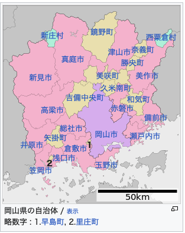

---
tags:
  - 岡
  - 山
  - 城
---
# <ruby>岡山<rt>おかやま</rt>県</ruby>

## <ruby>岡山城<rt>おかやまじょう</rt></ruby>

## 晴れの国（はれのくに）

## 岡山デミカツ丼

"デミグラス" (demigurasu), Demi-glace is a rich, brown sauce in French cuisine

## Reference

* [歡迎來到岡山，陽光之國！](https://www.okayama-japan.jp/tw)
